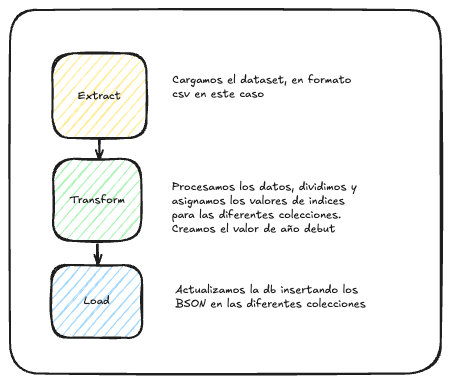

### Actividad Bases de Datos NoSQL

### Caso de uso
### Tareas
Las tareas que se piden son las siguientes:
1. Explicar las ventajas y desventajas de la BD NOSQL seleccionada, en resumen, el por
qué.
2. Definir el esquema, y las sentencias de creación de este, ya sean generación de tablas,
grafos o documentos…
3. Definir las sentencias de inserción para 100 registros del dataset. Si es necesario
utilizar un script para adaptar la inserción desde el csv o usar un API (por ejemplo, de
Python), adjuntar el script y explicar el por qué y cómo se ejecutaría.
4. Definir (si se puede) sentencias de modificación para dos de los registros, cambiando
el nombre de la jugadora a Mayúsculas.
5. Definir las siguientes consultas:
a. Consulta por una jugadora especifico
i. Filtrando por el año de comienzo en el football mayor de 2020
ii. Filtrando que el equipo que empiece “Machester…..”
b. Consulta por un país concreto donde juega una jugadora
